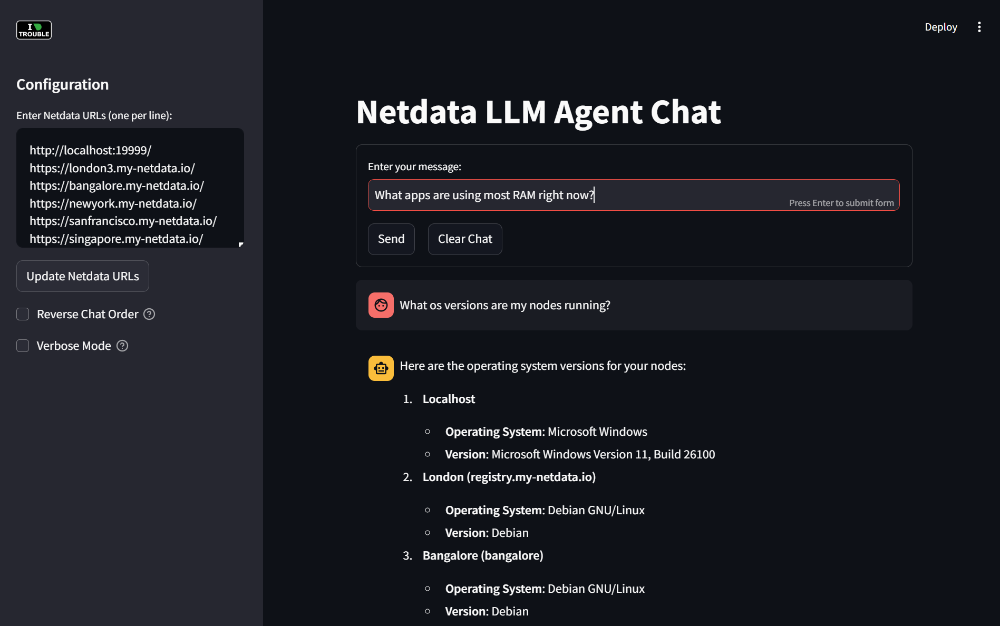

# Netdata LLM Agent

[](https://codespaces.new/andrewm4894/netdata-llm-agent)

<a target="_blank" href="https://pypi.org/project/netdata-llm-agent">
  
</a>
<a target="_blank" href="https://colab.research.google.com/github/andrewm4894/netdata-llm-agent/blob/main/notebooks/examples.ipynb">
  
</a>

An LLM agent for chatting with your netdata server's.

- [Installation](#installation) - How to install the package.
- [App](#app-example) - A little streamlit app that uses the agent to chat with your netdata server's.
- [CLI](#cli-example) - A very simplistic cli tool that uses the agent to chat with your netdata server's on command line.
- [Code](#code-example) - A code example of how to chat with the agent in python.
- Ollama - Can use local models via [Ollama](https://ollama.com/) (via [LangChain](https://python.langchain.com/docs/integrations/providers/ollama/)).
- [Source](./netdata_llm_agent/agent.py) - start here to explore the code - really its just [tools.py](./netdata_llm_agent/tools.py) to define various tools over the api and docs etc. and [agent.py](./netdata_llm_agent/agent.py) to use those tools and system prompt to make a `NetdataLLMAgent` class.

See [example notebook](./notebooks/examples.ipynb) for more updated examples or check out some of the example chats in the [example_chats](./example_chats) folder.

Tools the [agent](./netdata_llm_agent/agent.py) has access to ([source](./netdata_llm_agent/tools.py)):
- `get_info(netdata_host_url)` : Get Netdata info about a node.
- `get_charts(netdata_host_url, search_term)` : Get Netdata charts, optionally filter by search_term.
- `get_chart_info(netdata_host_url, chart)` : Get Netdata chart info for a specific chart.
- `get_chart_data(netdata_host_url, chart, after, before, points, options, df_freq)` : Get Netdata chart data for a specific chart. Optionally filter by after, before, points, options, and df_freq. options can be used to add optional flags for example 'anomaly-bit' will return anomaly rates rather than raw metric values.
- `get_alarms(netdata_host_url, all, active)` : Get Netdata alarms. all=True to get all alarms, active=True to get active alarms (warning or critical).
- `get_current_metrics(netdata_host_url, search_term)` : Get current metrics values for all charts, no time range, just the current values for all dimensions on all charts. Optionally filter by search_term on chart name.
- `get_anomaly_rates(netdata_host_url, after, before, search_term)` : Get anomaly rates for a specific time frame for all charts or optionally filter by search_term on chart name.
- `get_netdata_docs_sitemap(search_term)` : Get Netdata docs sitemap to list available Netdata documentation pages. Use search_term to filter by a specific term.
- `get_netdata_docs_page(url)` : Get Netdata docs page content for a specific docs page url on learn.netdata.cloud.

## Installation

```bash
# installing from pypi
pip install netdata-llm-agent

# installing from source
git clone https://github.com/andrewm4894/netdata-llm-agent.git
cd netdata-llm-agent
python -m venv .venv
source .venv/bin/activate
make requirements-install
make cli
```

## App Example

A little streamlit app that uses the agent to chat with your netdata server's ([source](./netdata_llm_agent/app.py)).

```bash
# if installed via pip
netdata-llm-app

# if working from source
make app
```



## CLI Example

A very simplistic cli tool that uses the agent to chat with your netdata server's on command line ([source](./netdata_llm_agent/cli.py)).

```bash
# if cloning the repo
make cli

# or if installed via pip
netdata-llm-cli
```

```text
(venv) PS C:\Users\andre\Documents\repos\netdata-llm-agent> netdata-llm-cli
──────────────────────────────────────────────────

┏━━━━━━━━━━━━━━━━━━━━━━━━━━━━━━━━━━━━━━━━━━━━━━━━━━━━━━━━━━━━━━━━━━━━━━━━━━━━━━━━━━━━━━━━━━━━━━━━━━━━━━━━━━━━━━━━━━━━━━━━━━━━━━━━━━━┓
┃                                               Welcome to the Netdata LLM Agent CLI!                                               ┃
┗━━━━━━━━━━━━━━━━━━━━━━━━━━━━━━━━━━━━━━━━━━━━━━━━━━━━━━━━━━━━━━━━━━━━━━━━━━━━━━━━━━━━━━━━━━━━━━━━━━━━━━━━━━━━━━━━━━━━━━━━━━━━━━━━━━━┛

 • Type your query about Netdata (e.g., charts, alarms, metrics) and press Enter
 • Type /exit, /quit or /bye to end the session
 • Type /save to save the chat history to a file
 • Type /good to save with good_ prefix, /bad to save with bad_ prefix (useful for debugging in langsmith)
 • Type /reset to clear chat history and restart the agent

──────────────────────────────────────────────────

You: how are mysql metrics looking on london over the last 15 minutes - anythinng to worry about?
──────────────────────────────────────────────────

Agent: Here's a summary of the MySQL metrics from the London Netdata host over the last 15 minutes:

 1 CPU Utilization
    • User CPU Utilization: Ranges between 0.209542 to 0.379086, indicating a stable utilization around 30-37%.
    • System CPU Utilization: Mostly around 0 indicating very low system-level CPU usage.
 2 Memory Usage
    • RSS Memory Usage: Remains constant at 234.918 MB throughout the sampling period.
 3 Active Connections
    • There has been a maximum of 1 active connection with a limit of 151 connections and maximum throughput of 2 active connections.
 4 InnoDB Deadlocks
    • There were 0 deadlocks recorded, indicating no issues related to deadlocks during this time span.

                                                             Conclusion:

Overall, the MySQL metrics in London indicate normal operation with no alarming signs:

 • CPU and memory usage are stable and well within acceptable limits.
 • Active connections are within the operational ceiling.
 • No deadlocks were recorded.

There doesn't appear to be anything to worry about based on the current metrics.

──────────────────────────────────────────────────

You: how do nginx metrics look over same timerange on that node?
──────────────────────────────────────────────────

Agent: Here's a summary of the Nginx metrics from the London Netdata host over the last 15 minutes:

 1 Total Requests
    • The total client requests have fluctuated between 8.06 and 18.06 requests per minute, indicating a stable request traffic.
 2 Active Client Connections
    • Active client connections have varied from 147 to 182. This shows that the server is handling a consistent level of active
      connections, peaking occasionally.
 3 Connection Statuses
    • The connection statuses indicate that the majority of active connections are in an idle state, with a slight activity detected
      in read and write operations.
 4 CPU Utilization
    • Nginx CPU utilization has reached a maximum of approximately 0.367 (user) and 0.339 (system), demonstrating efficient CPU usage
      without signs of strain.
 5 Memory Usage
    • Nginx memory usage has remained stable around 43.8 MB of RAM with no swap memory usage detected, which is optimal.

                                                             Conclusion:

The Nginx metrics on the London node appear to be stable and efficient:

 • Request load and active connections are well managed.
 • CPU and memory usage are both maintained at reasonable levels.

Overall, there doesn’t seem to be anything concerning based on the current Nginx metrics.

──────────────────────────────────────────────────

You: /good
Chat history saved to: example_chats/good_MySQL_and_Nginx_Metrics_Summary_20250203_135458_403cf2dc.md
```

## Code Example

```python
from netdata_llm_agent.agent import NetdataLLMAgent

# list of netdata urls to interact with
netdata_urls = [
    'https://localhost:19999/',
    'https://london3.my-netdata.io/',
    'https://bangalore.my-netdata.io/',
    'https://newyork.my-netdata.io/',
    'https://sanfrancisco.my-netdata.io/',
    'https://singapore.my-netdata.io/',
    'https://toronto.my-netdata.io/',
]

# create agent
agent = NetdataLLMAgent(netdata_urls, model='gpt-4o-mini')
# create agent using anthropic
# agent = NetdataLLMAgent(netdata_urls, model='claude-3-5-sonnet-20241022', platform='anthropic')
# create agent using ollama
# agent = NetdataLLMAgent(netdata_urls, model='llama3.1', platform='ollama')

# chat with the agent
agent.chat('How much disk space is on london?', verbose=True, no_print=False)
```

Response:

```markdown
================================ Human Message =================================

How much disk space is on london?
================================== Ai Message ==================================
Tool Calls:
  get_charts (call_7j6IPWtLVu4OwvVFywmHmYIa)
 Call ID: call_7j6IPWtLVu4OwvVFywmHmYIa
  Args:
    netdata_host_url: https://london3.my-netdata.io/
    search_term: disk
================================= Tool Message =================================
Name: get_charts

[
  [
    "netdata.dbengine_query_pages_disk_load",
    "Netdata Query Pages Loaded from Disk (netdata.dbengine_query_pages_disk_load)"
  ],
  [
    "disk_space./",
    "Disk Space Usage (disk_space./)"
  ],
  ...
  [
    "app.certbot_disk_logical_io",
    "Applications Groups disk logical IO (app.certbot_disk_logical_io)"
  ]
]
================================== Ai Message ==================================
Tool Calls:
  get_chart_data (call_fdvYLm2ntI6W2VwwMNaLPavO)
 Call ID: call_fdvYLm2ntI6W2VwwMNaLPavO
  Args:
    netdata_host_url: https://london3.my-netdata.io/
    chart: disk_space./
================================= Tool Message =================================
Name: get_chart_data

    avail     used  reserved for root
112.77004 38.23786           6.435379
112.76998 38.23793           6.435379
112.76992 38.23798           6.435379
112.76983 38.23807           6.435379
112.76977 38.23814           6.435379
112.76972 38.23818           6.435379
112.76966 38.23825           6.435379
112.76953 38.23837           6.435379
112.76926 38.23865           6.435379
112.76921 38.23869           6.435379
112.76912 38.23878           6.435379
112.76907 38.23883           6.435379
================================== Ai Message ==================================

The disk space on the London Netdata server is as follows:

- **Available Disk Space:** Approximately **112.77 GiB**
- **Used Disk Space:** Approximately **38.24 GiB**
- **Reserved for Root:** Approximately **6.44 GiB**

Let me know if you need more information!
================================== Ai Message ==================================

The disk space on the London Netdata server is as follows:

- **Available Disk Space:** Approximately **112.77 GiB**
- **Used Disk Space:** Approximately **38.24 GiB**
- **Reserved for Root:** Approximately **6.44 GiB**

Let me know if you need more information!

```
